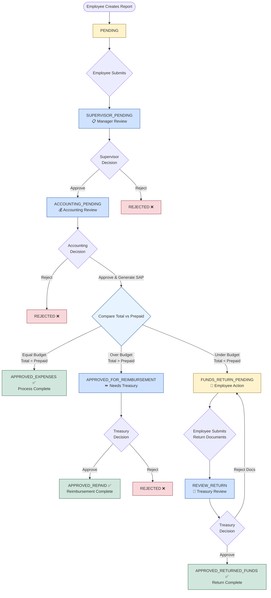
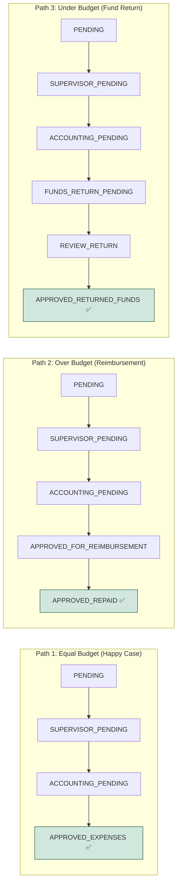
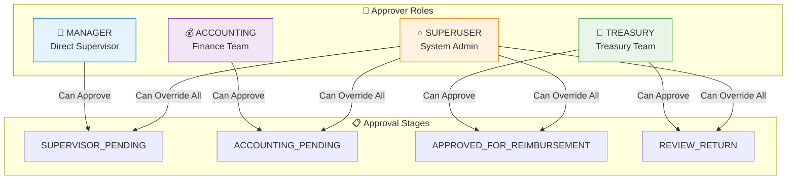
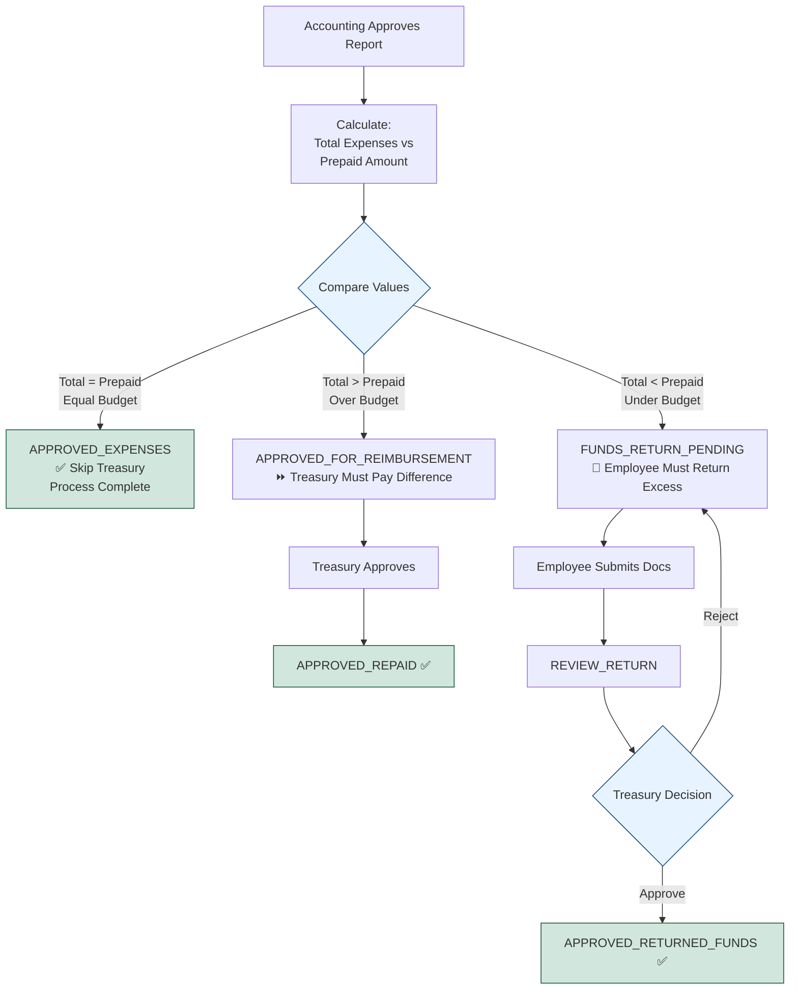
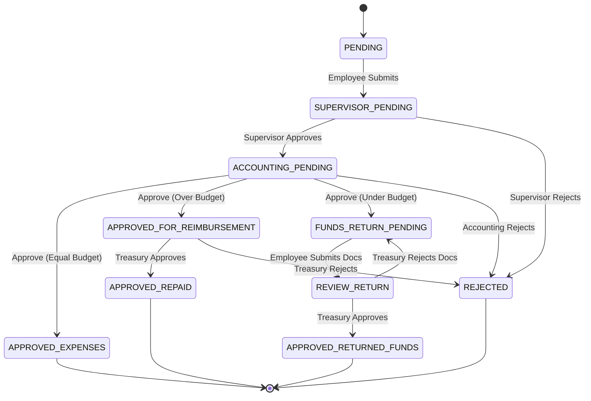
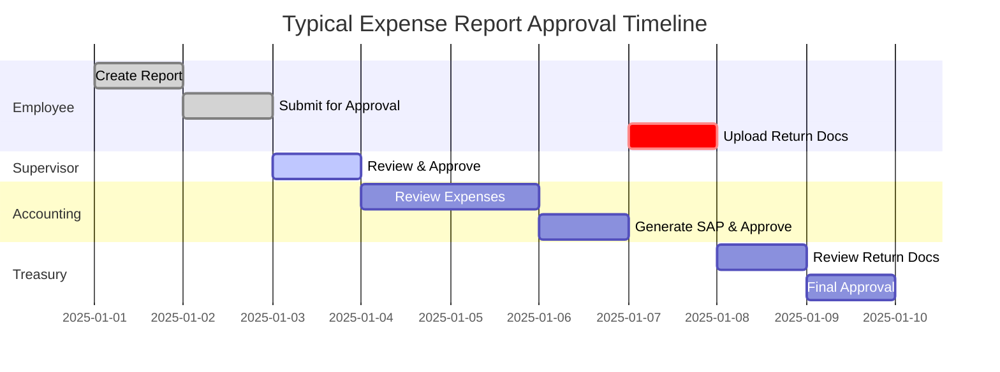

# 📊 Expense Reports Approval Process - Visual Flowchart

## Interactive Visual Diagram

Copy the code below and paste it into:
- **GitHub** (renders automatically in .md files)
- **Mermaid Live Editor**: https://mermaid.live
- **Notion**, **Confluence**, or any Mermaid-compatible tool

---

## 🔄 Complete Approval Workflow



---

## 🎨 Color Legend

- 🟨 **Yellow** - Employee action required (PENDING, FUNDS_RETURN_PENDING)
- 🟦 **Blue** - Approval stages (SUPERVISOR_PENDING, ACCOUNTING_PENDING, REVIEW_RETURN, APPROVED_FOR_REIMBURSEMENT)
- 🟩 **Green** - Final success states (APPROVED_EXPENSES, APPROVED_REPAID, APPROVED_RETURNED_FUNDS)
- 🟥 **Red** - Rejected states
- 💠 **Light Blue** - Business logic decision point

---

## 📊 Simplified Three-Path View



---

## 👥 Approver Roles Diagram



---

## 🔀 Business Logic Decision Tree



---

## 📈 Status Transition Matrix



---

## 📊 Timeline View (Typical Flow)



---

## 🎯 Quick Reference: All 12 Statuses

| Status | Type | Description | Who Acts |
|--------|------|-------------|----------|
| **PENDING** | 🟨 Employee | Initial state after creation | Employee submits |
| **SUPERVISOR_PENDING** | 🟦 Workflow | Awaiting manager approval | Manager |
| **ACCOUNTING_PENDING** | 🟦 Workflow | Awaiting accounting review | Accounting |
| **APPROVED_EXPENSES** | 🟩 Final | Approved, equal budget | - |
| **APPROVED_FOR_REIMBURSEMENT** | 🟦 Workflow | Needs treasury payment | Treasury |
| **FUNDS_RETURN_PENDING** | 🟨 Employee | Employee must upload docs | Employee |
| **REVIEW_RETURN** | 🟦 Workflow | Treasury reviewing return docs | Treasury |
| **APPROVED_REPAID** | 🟩 Final | Reimbursement complete | - |
| **APPROVED_RETURNED_FUNDS** | 🟩 Final | Fund return complete | - |
| **REJECTED** | 🟥 Final | Report rejected | - |

---

## 🔗 Integration Points

```mermaid
flowchart LR
    subgraph Frontend["🖥️ Frontend"]
        UI[User Interface]
        Forms[Approval Forms]
    end
    
    subgraph Backend["⚙️ Backend API"]
        Routes[/api/approvals/*]
        Logic[Business Logic]
        SAP[SAP File Generator]
    end
    
    subgraph Database["🗄️ Database"]
        Reports[(Reports Table)]
        History[(Approval History)]
    end
    
    subgraph External["🔌 External"]
        Email[📧 Email Service<br/>Async Notifications]
        SAPSystem[SAP System<br/>File Import]
    end
    
    UI --> Routes
    Forms --> Routes
    Routes --> Logic
    Logic --> Reports
    Logic --> History
    Logic --> SAP
    SAP --> SAPSystem
    Logic --> Email
```

---

## 📝 How to Use This Flowchart

### **Option 1: GitHub/GitLab**
1. Copy this entire file to your repository
2. Mermaid diagrams render automatically in `.md` files
3. Share the GitHub link with your team

### **Option 2: Mermaid Live Editor**
1. Go to https://mermaid.live
2. Copy any diagram code block
3. Paste into the editor
4. Export as PNG/SVG/PDF

### **Option 3: Notion/Confluence**
1. Create a code block
2. Set language to `mermaid`
3. Paste the diagram code
4. It will render automatically

### **Option 4: Export as Image**
```bash
# Using mermaid-cli (install: npm install -g @mermaid-js/mermaid-cli)
mmdc -i docs/REPORTS_APPROVAL_FLOWCHART_VISUAL.md -o reports-flow.png
```

---

## 🔍 Key Decision Points Summary

1. **After Supervisor Approval** → Always goes to Accounting
2. **After Accounting Approval** → Business logic determines path:
   - Equal → Final approval ✅
   - Over → Treasury (reimbursement)
   - Under → Employee (return docs) → Treasury
3. **Treasury Fund Return Rejection** → Loops back to employee (unique!)
4. **Any Stage Rejection** → Terminal REJECTED state

---

**Last Updated**: September 30, 2025  
**System**: Viaticos 2025 v1.0  
**Environment**: https://amcor-viaticos2025.tech-labs.org

---

## 📥 Download Links

- [Text Version](REPORTS_APPROVAL_FLOWCHART.md) - Complete documentation
- [Visual Version](REPORTS_APPROVAL_FLOWCHART_VISUAL.md) - This file (Mermaid diagrams)
