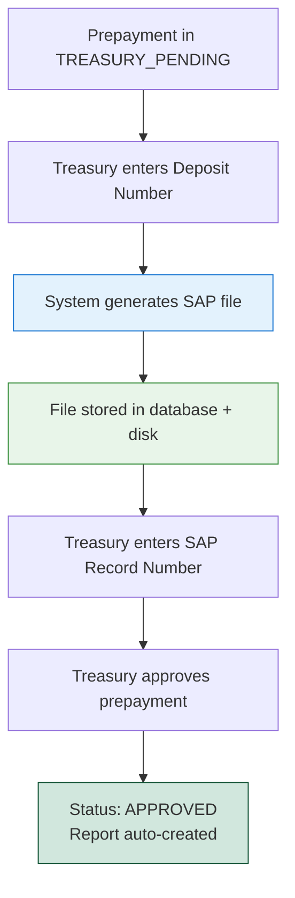

# 📄 SAP Prepayment File Specification

## Overview
The SAP Prepayment File is a **semicolon-delimited text file** generated by the Treasury team when approving a prepayment request. It contains all necessary financial data for importing the prepayment transaction into the SAP system.

---

## 🔧 When It's Generated

### **Trigger**: Treasury Approval - Step 1
1. Prepayment reaches status: `TREASURY_PENDING`
2. Treasury user enters **Deposit Number**
3. System automatically generates SAP file
4. File is stored and attached to the prepayment record

### **API Endpoint**:
```
POST /api/approvals/prepayments/{prepayment_id}/treasury/deposit
```

**Request Body**:
```json
{
  "deposit_number": "DEP-2025-001"
}
```

---

## 📋 File Format Specification

### **File Naming Convention**:
```
prepayment-{prepayment_id}-sap.txt
```
**Example**: `prepayment-42-sap.txt`

### **Content Format**:
- **Delimiter**: Semicolon (`;`)
- **Encoding**: UTF-8
- **Structure**: Single line with 18 fields
- **Extension**: `.txt`

---

## 📊 Field Structure (18 Fields)

| # | Field Name | Description | Example | Source |
|---|------------|-------------|---------|--------|
| 1 | **COMP_CODE** | Company/Location SAP Code | `LIM001` | `user.location.sap_code` |
| 2 | **DOC_DATE** | Document Date | `31.12.2024` | Current date (DD.MM.YYYY) |
| 3 | **PSTNG_DATE** | Posting Date | `31.12.2024` | Current date (DD.MM.YYYY) |
| 4 | **REF_DOC_NO** | Reference Document Number | `DEP-2025-001` | Treasury deposit number |
| 5 | **ITEMNO_ACC** | Item Number | `0000000001` | Static value |
| 6 | **HEADER_TXT** | Header Text | `Business trip to Lima` | `prepayment.reason` |
| 7 | **VENDOR_NO** | Vendor/Employee SAP Code | `EMP001` | `user.sap_code` |
| 8 | **PROFIT_CTR** | Profit Center/Cost Center | `ADMIN` | `location.cost_center` |
| 9 | **CURRENCY** | Currency Code | `USD` | `prepayment.currency.code` |
| 10 | **AMT_DOCCUR** | Amount (negative) | `-1500.00` | `-prepayment.amount` |
| 11 | **GL_ACCOUNT** | General Ledger Account | `1234567890` | `location_currency.account` |
| 12 | **ITEM_TEXT** | Item Text | `Business trip to Lima` | `prepayment.reason` |
| 13 | **COSTCENTER** | Cost Center | *(empty)* | Empty string |
| 14 | **ALLOC_NMBR** | Allocation Number | *(empty)* | Empty string |
| 15 | **VALUE_DATE** | Value Date | `31.12.2024` | Current date (DD.MM.YYYY) |
| 16 | **AMT_DOCCUR** | Amount (duplicate) | *(empty)* | Empty string |
| 17 | **TAX_CODE** | Tax Code | *(empty)* | Empty string |
| 18 | **MOVIMIENTO** | Movement Type | `ANTICIPO` | Static: "ANTICIPO" |

---

## 💡 Example File Content

### **Scenario**:
- Prepayment ID: 42
- Employee: Juan Pérez (SAP Code: `JPN001`)
- Location: Lima, Peru (SAP Code: `LIM001`, Cost Center: `ADMIN`)
- Currency: USD
- Amount: $1,500.00
- Reason: "Business trip to New York"
- Deposit Number: `DEP-2025-042`
- Location Currency Account: `1234567890`

### **Generated File**:
```
LIM001;31.01.2025;31.01.2025;DEP-2025-042;0000000001;Business trip to New York;JPN001;ADMIN;USD;-1500.00;1234567890;Business trip to New York;;;31.01.2025;;;ANTICIPO
```

### **Breakdown (with field separators visible)**:
```
LIM001               ; Location SAP code
31.01.2025           ; Document date
31.01.2025           ; Posting date
DEP-2025-042         ; Deposit number
0000000001           ; Item number
Business trip to NY  ; Header text (reason)
JPN001               ; Employee SAP code
ADMIN                ; Cost center
USD                  ; Currency
-1500.00             ; Amount (negative)
1234567890           ; GL Account
Business trip to NY  ; Item text (reason)
                     ; Cost center (empty)
                     ; Allocation number (empty)
31.01.2025           ; Value date
                     ; Amount duplicate (empty)
                     ; Tax code (empty)
ANTICIPO             ; Movement type (static)
```

---

## 🔍 Data Validation Rules

### **Required Data** (will error if missing):

1. **User Data**:
   - ✅ `user.location` must be assigned
   - ✅ `user.sap_code` must be assigned

2. **Location Data**:
   - ✅ `location.sap_code` must be assigned
   - ✅ `location.cost_center` must be assigned

3. **Location Currency Configuration**:
   - ✅ `location_currencies` table must have entry for:
     - `location_id` = user's location
     - `currency_id` = prepayment's currency
   - ✅ Record must have `account` field populated

### **Error Messages**:
```
"User {name} does not have a location assigned. Please assign a location and retry."

"User {name} does not have a SAP code assigned. Please assign a SAP code and retry."

"Location {name} does not have a SAP code assigned. Please assign a SAP code and retry."

"Location {name} does not have a cost center assigned. Please assign a cost center and retry."

"Location {name} does not have account configured for currency {code}. Please configure the account and retry."
```

---

## 💰 Amount Formatting

### **Rules**:
1. **Negative Sign**: Always prepended with `-`
2. **Decimals**:
   - If whole number: `-1500` (no decimals)
   - If has cents: `-1500.50` (2 decimal places)

### **Examples**:
```python
Amount: 1500.00   → Output: "-1500"
Amount: 1500.50   → Output: "-1500.50"
Amount: 999.99    → Output: "-999.99"
Amount: 2000      → Output: "-2000"
```

---

## 📁 File Storage

### **Storage Location**:
```
storage/uploads/sap_files/prepayment-{id}-sap.txt
```

### **Database Reference**:
Stored in `prepayments` table:
```sql
sap_prepayment_file VARCHAR(500)
```

**Example value**: `sap_files/prepayment-42-sap.txt`

---

## 🔐 Download Permissions

### **Who Can Download**:
- ✅ **Treasury Users** (`is_approver=true` AND `profile=TREASURY`)
- ✅ **Superusers** (`is_superuser=true`)

### **API Endpoint**:
```
GET /api/approvals/prepayments/{prepayment_id}/sap-file
```

**Response**:
```
Content-Type: text/plain
Content-Disposition: attachment; filename="prepayment-42-sap.txt"
```

---

## 🔄 Treasury Approval Workflow

### **Complete Treasury Process**:



### **Step-by-Step**:

1. **Step 1: Generate SAP File**
   - Endpoint: `POST /api/approvals/prepayments/{id}/treasury/deposit`
   - Input: Deposit number
   - Output: SAP file generated and stored
   - Status: Remains `TREASURY_PENDING`

2. **Step 2: Record SAP Number**
   - Endpoint: `POST /api/approvals/prepayments/{id}/treasury/sap-record`
   - Input: SAP record number (from SAP system after import)
   - Output: SAP record number stored
   - Status: Remains `TREASURY_PENDING`

3. **Step 3: Final Approval**
   - Endpoint: `POST /api/approvals/prepayments/{id}/approve`
   - Action: Approve
   - Output: Prepayment approved, expense report auto-created
   - Status: `APPROVED`

---

## 🗄️ Database Schema

### **Related Tables**:

```sql
-- Prepayments table
CREATE TABLE prepayments (
    id SERIAL PRIMARY KEY,
    -- ... other fields ...
    deposit_number VARCHAR(100),           -- Treasury deposit #
    sap_prepayment_file VARCHAR(500),      -- File path
    sap_record_number VARCHAR(100),        -- SAP system record #
    -- ... other fields ...
);

-- Location Currencies (for GL account mapping)
CREATE TABLE location_currencies (
    id SERIAL PRIMARY KEY,
    location_id INTEGER REFERENCES locations(id),
    currency_id INTEGER REFERENCES currencies(id),
    account VARCHAR(20) NOT NULL,          -- GL Account for this location+currency
    UNIQUE(location_id, currency_id)
);
```

---

## 🎯 Key Differences: Prepayment vs Expense Report SAP Files

| Aspect | Prepayment SAP File | Expense Report SAP Files |
|--------|---------------------|--------------------------|
| **When Generated** | Treasury approval (Step 1) | Accounting approval |
| **Number of Files** | 1 file | 2 files (expenses + compensation) |
| **Generated By** | Treasury Team | Accounting Team |
| **Movement Type** | `ANTICIPO` (static) | `COMPENSACION` (expenses), varies (compensation) |
| **Amount Sign** | Always negative | Varies by document type |
| **File Naming** | `prepayment-{id}-sap.txt` | `report-{id}-expenses.txt`, `report-{id}-compensation.txt` |
| **Content** | Single transaction line | Multiple expense lines + compensation lines |
| **Status When Generated** | `TREASURY_PENDING` | `ACCOUNTING_PENDING` |

---

## 🚨 Common Issues

### **Issue 1: Missing Location Currency Configuration**
**Error**: `Location Lima does not have account configured for currency USD`

**Solution**:
1. Go to Settings → Locations
2. Edit the user's location
3. Add currency mapping with GL account number
4. Retry SAP file generation

### **Issue 2: User Without SAP Code**
**Error**: `User Juan Pérez does not have a SAP code assigned`

**Solution**:
1. Go to Settings → Users
2. Edit the user
3. Assign SAP code
4. Retry SAP file generation

### **Issue 3: File Not Found on Download**
**Error**: `SAP file not found on disk`

**Solution**:
1. Regenerate SAP file by updating deposit number
2. Check file permissions on server
3. Verify `storage/uploads/sap_files/` directory exists

---

## 📝 Field Mapping Reference

### **Quick Lookup**:
```python
# Python code reference from sap_service.py
fields = [
    location.sap_code,                    # Field 1
    date_str,                             # Field 2
    date_str,                             # Field 3
    deposit_number,                       # Field 4
    "0000000001",                         # Field 5
    prepayment.reason,                    # Field 6
    user.sap_code,                        # Field 7
    location.cost_center,                 # Field 8
    prepayment.currency.code,             # Field 9
    amount_str,                           # Field 10 (negative)
    location_currency.account,            # Field 11
    prepayment.reason,                    # Field 12
    "",                                   # Field 13 (empty)
    "",                                   # Field 14 (empty)
    date_str,                             # Field 15
    "",                                   # Field 16 (empty)
    "",                                   # Field 17 (empty)
    "ANTICIPO"                            # Field 18 (static)
]
```

---

## 🔗 Related Documentation

- [Reports Approval Flowchart](REPORTS_APPROVAL_FLOWCHART.md) - Complete approval workflow
- [Visual Flowcharts](REPORTS_APPROVAL_FLOWCHART_VISUAL.md) - Mermaid diagrams
- [SAP Expense Files Specification](SAP_EXPENSE_FILES_SPECIFICATION.md) - For expense reports

---

**Last Updated**: October 1, 2025  
**System Version**: Viaticos 2025 v1.0  
**Module**: Treasury Approval - Prepayments  
**File Format Version**: 1.0
